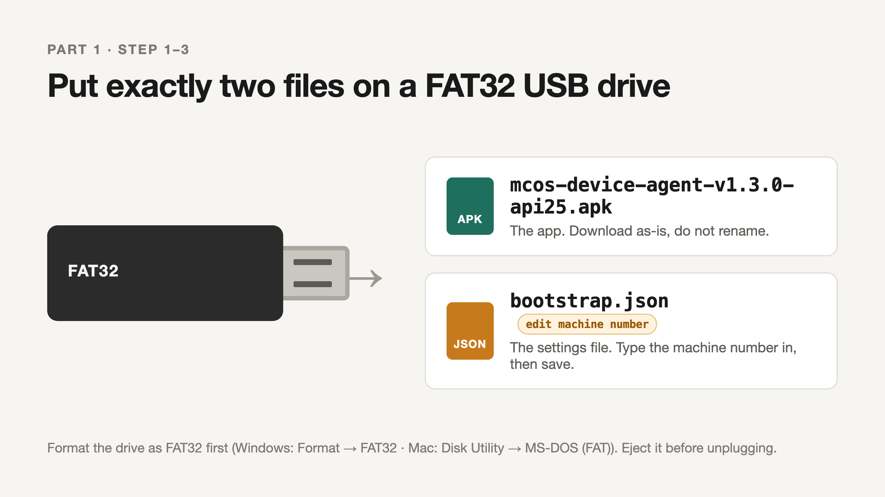
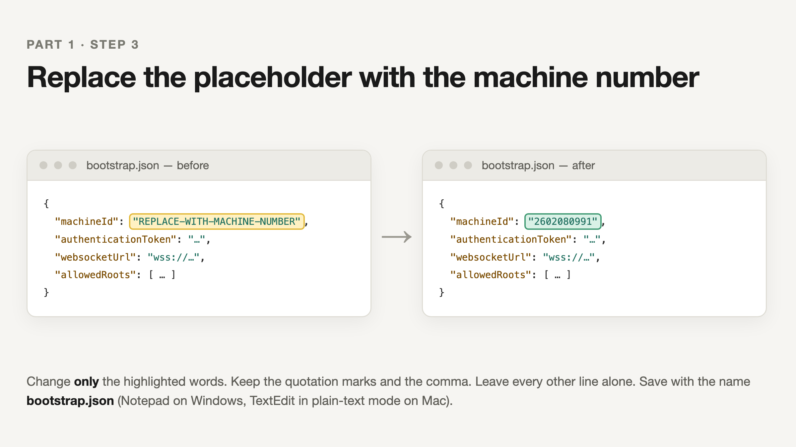
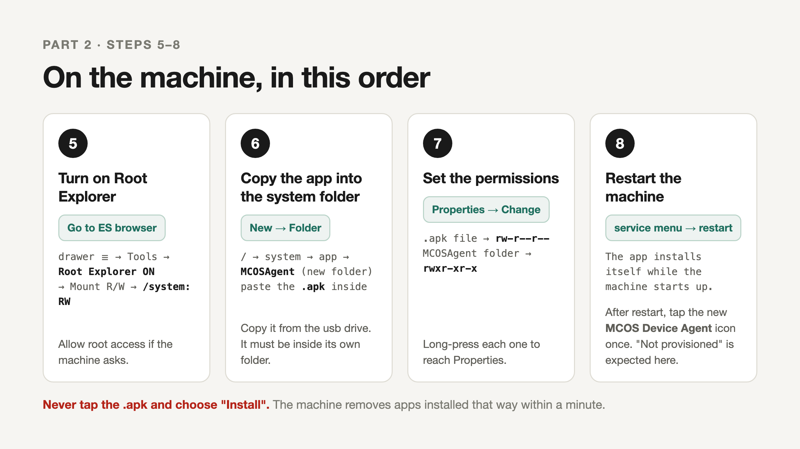
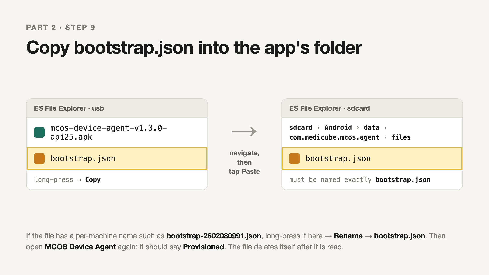

# MCOS Device Agent — install guide

This page walks you through putting the **MCOS Device Agent** app on a MediCube vending machine. No special tools are needed: a computer, a USB thumb drive, and about 15 minutes at the machine.

The app runs quietly in the background and lets MediCube manage the screen on the machine remotely. It does **not** change how the machine vends.

---

## What you need

| | |
|---|---|
| A USB thumb drive | Any size. It will be erased. |
| A computer | Windows or Mac, to prepare the drive. |
| The machine's number | Printed on the machine, usually a 10-digit number such as `2602080991`. |
| The admin gesture + PIN | Used to open the machine's service menu. Your MediCube contact has these. |

---

## Part 1 — Prepare the USB drive (on your computer)



### 1. Format the drive as FAT32

The machine only reads FAT32 drives.

- **Windows:** right-click the drive → **Format** → File system: **FAT32** → Start.
- **Mac:** open **Disk Utility** → select the drive → **Erase** → Format: **MS-DOS (FAT)** → Erase.

### 2. Download the two files from this page

Right-click each link and choose **Save link as…**, then save both to the USB drive.

1. **[mcos-device-agent-v1.3.0-api25.apk](https://github.com/0xadamm/mcos-agent-apk/raw/main/mcos-device-agent-v1.3.0-api25.apk)** — the app itself.
2. **[bootstrap.json](https://github.com/0xadamm/mcos-agent-apk/raw/main/bootstrap.json)** — a small settings file that tells the app which machine it is on.

### 3. Type the machine number into `bootstrap.json`



Open `bootstrap.json` **from the USB drive** in a plain text editor:

- **Windows:** right-click the file → **Open with** → **Notepad**.
- **Mac:** right-click the file → **Open With** → **TextEdit**. If TextEdit shows a formatting toolbar, choose **Format → Make Plain Text** first.

Find this line:

```
"machineId": "REPLACE-WITH-MACHINE-NUMBER",
```

Replace only the words `REPLACE-WITH-MACHINE-NUMBER` with the machine's number. Keep the quotation marks. For machine 2602080991 the line becomes:

```
"machineId": "2602080991",
```

Do not change anything else in the file. Save it, keeping the name `bootstrap.json`.

> Doing several machines in one trip? Make one copy per machine on the drive, named `bootstrap-2602080991.json`, `bootstrap-2602080992.json`, and so on. At each machine you will copy the matching one and rename it to `bootstrap.json` (step 10).

### 4. Eject the drive

Use **Safely Remove** (Windows) or **Eject** (Mac) before unplugging, so the files finish writing.

---

## Part 2 — Install on the machine

> **Important: do not tap the APK and choose "Install".** These machines automatically remove apps installed that way within about a minute. The app has to be placed in the machine's system folder instead, and then the machine is restarted. The steps below do exactly that.



### 5. Open the file manager and turn on Root Explorer

Open the machine's **service menu** (admin gesture + PIN) and tap **"Go to ES browser"**. This opens **ES File Explorer**.

> Use the **"Go to ES browser"** button, not any other way of opening ES. Other routes only open a photo/music picker.

In ES File Explorer:

1. Open the left-hand drawer (the **☰** icon, or swipe in from the left edge) and scroll down to **Tools**.
2. Switch **Root Explorer** to **ON**. If the machine asks to allow root access, allow it.
3. Tap the words **Root Explorer** to open its options, choose **Mount R/W**, and set **/system** to **RW**. Tap OK.

### 6. Copy the app into the system folder

1. Plug the USB drive into a USB port on the machine's board.
2. In ES, go to the machine's top-level folder (in the drawer, tap **Device** or **/**), then open **system**, then **app**.
3. Tap **New → Folder** and name it exactly `MCOSAgent`. Open that new folder.
4. In the drawer tap **usb**, **long-press** `mcos-device-agent-v1.3.0-api25.apk` → **Copy**.
5. Go back to **/system/app/MCOSAgent/** and tap **Paste**.

If the USB drive does not appear in the drawer within a few seconds, unplug it and try another port.

### 7. Set the permissions

Still in **/system/app/MCOSAgent/**:

1. **Long-press** the APK file → **Properties** → next to Permissions tap **Change**. Tick the boxes so it reads **Owner: Read + Write · Group: Read · Other: Read** (shown as `rw-r--r--`). Tap OK.
2. Go up one level to **/system/app/**, **long-press** the **MCOSAgent** folder → **Properties** → **Change**. Tick so it reads **Owner: Read + Write + Execute · Group: Read + Execute · Other: Read + Execute** (shown as `rwxr-xr-x`). Tap OK.

### 8. Restart the machine

Restart the machine from the service menu, or power it off and on. **Do not tap the APK and choose Install.** The machine installs the app from the system folder while it starts up.

### 9. Open the app once

After the restart, find the new **MCOS Device Agent** icon (it looks like a rounded square with "MC" on it) in the app list and **tap it once**. It will say **"Not provisioned"**. That is expected. Opening it once creates the folder you need next. Press back.

### 10. Copy the settings file into the app's folder



Open the service menu → **"Go to ES browser"** again if needed. Then in ES File Explorer:

1. Go to **usb** and **long-press** `bootstrap.json` → **Copy**.
2. Navigate to this folder: **sdcard → Android → data → com.medicube.mcos.agent → files**
3. Tap **Paste**.
4. If you used a per-machine name such as `bootstrap-2602080991.json`, long-press it → **Rename** → change it to exactly `bootstrap.json`. The app ignores any other name.

### 11. Start the app

Open **MCOS Device Agent** again. The screen should now show **Provisioned** with the machine number. The settings file disappears from the folder on its own once it has been read. That is normal.

---

## Please do not

- **Do not uninstall, disable, or force-stop the vending app.** It is what makes the machine vend and it is very hard to restore.
- **Do not change anything in the service menu other than "Go to ES browser" and the restart.**
